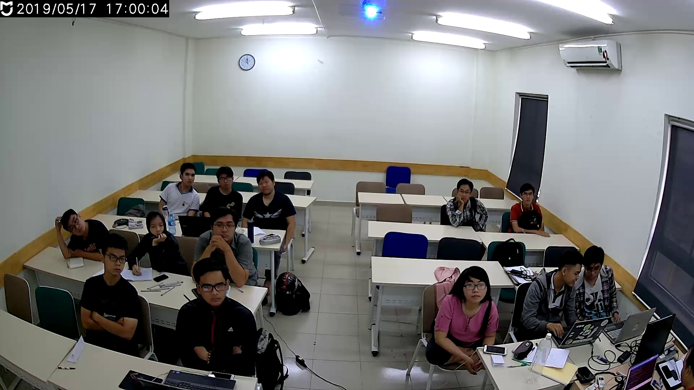
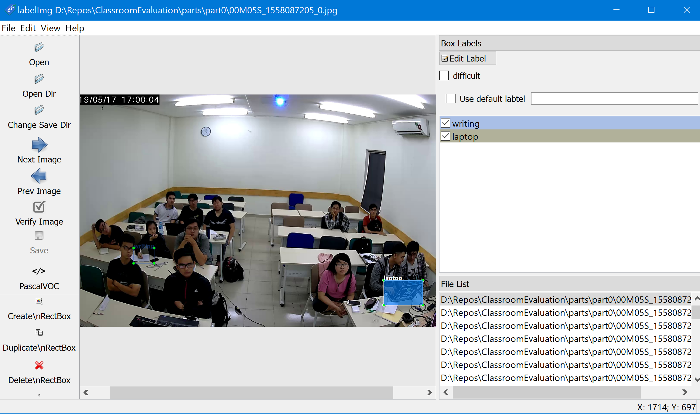

# Classroom Evaluation

---

## Content

[1. Introduction](#intro)

[2. Plan](#plan)

[3. Data Preparation](#data)

[4. Student's behaviors](#behaviors)

[5. Facial expression](#facial)

[6. Movement](#movement)

[7. Application](#application)

[8. Conclusion](#conclusion)

[9. References](#ref)

[10. Acknowledgement](#ack)

---

## 1. Introduction <a name="intro"></a>

Nowaday, Vietnamese education still has some problems. One of them is how they can make sure the quality of teaching? How do the students digest new knowledge which is obtained from their teacher? This project provides a solution for above problem using Machine Learning techincal.

In a nut shell, **Classroom Evaluation** means using video record from classes and analyze them with ML/DL model to get new information.

**The definition of "Evaluation"**

> Detect activities, emotion and movement of student in their classroom during course via video recording, then, take some actions in other to improve peformance of studying and teaching process.

The 2nd University Machine Learning Camp at Jeju, South Korea is a good chance for me to research and implement this project.

---
## 2. Plan <a name="plan"></a>

During 3 weeks in the camp, I have planned what I have to do so that I get a runnable demo. After that, I can work on it to get the better result.

Here is my weekly plan:

Sun | Mon | Tue | Wed | Thu | Fri | Sat
----|-----|-----|-----|-----|-----|----
**Jul 14** | **Jul 15** | **Jul 16** | **Jul 17** | **Jul 18** | **Jul 19** | **Jul 20**
Check-in | Data preparation for facial expression detection | --- | Train Student's behaviors detection model | ---|Change hyperparameters and re-train| Fine-tune behaviors model |
**Jul 21** | **Jul 22** | **Jul 23** | **Jul 24** | **Jul 25** | **Jul 26** | **Jul 27**
Relax | Make **fer** dataset preprocessing script | Try to train with simple CNN architecture | Using Pretrained CNN (Inception v3) model from Keras - TensorFlow | Apply transfer learning with pretrained model from TensorFlow Hub | Try with difference hyperparameters | Setup TensorFlow environment on Google Cloud Platform (Compute Engine)
**Jul 28** | **Jul 29** | **Jul 30** | **Jul 31** | **Aug 1** | **Aug 2** | **Aug 3**
 Relax | Build Flask server to serve models via APIs | Deploy models and server to VM on GCP | Create Web App to consume these model |---| Final Presentation | Check-out |
---
## 3. Data Preparation <a name="data"></a>

This project contains two important models is Behaviors detection and facial expresison detection. So I have to prepare two dataset.

**For behaviors detection:**

Recording video from some classes at my university. I used a small IP Camera and attach it on the wall opposite the students as the picture below



I have recorded 15 hours video, then, splited them into single frames.
I pointed out some important activities which we need to focus on: **Taking note**, **Using laptop**, **Using phone**, **Sleeping**

On every still image, using LabelImg to crop the activities in the image.



The result of this process is a batch of XML files which contain annotation of boundary box.

I need convert all annotation into TFRecord which TensorFlow can read and work on. So, I have create a script to do this task.

```python

from collections import namedtuple, OrderedDict
from object_detection.utils import dataset_util
from PIL import Image
import tensorflow as tf
import pandas as pd
import io
import xml_to_csv
import os
import shutil

outputFiles = []

labelList = ["writing", "laptop", "phone", "sleeping"]

xml_dir_prefix = "output"
image_dir_prefix = "part"
save_dir = "dataset"

train_rate = 0.7
num_of_part = 7

for i in range(1, num_of_part):
    if os.path.exists("output" + str(i)):
        outputFiles.extend(
            ["output" + str(i) + "/" + dir for dir in os.listdir("output" + str(i))])

if os.path.exists(save_dir):
    shutil.rmtree(save_dir)
os.makedirs(save_dir)
os.makedirs(save_dir+"/train")
os.makedirs(save_dir+"/test")

num_of_train = train_rate * len(outputFiles)

# Generate raw dataset

for i in range(len(outputFiles)):
    file_name = outputFiles[i].split('/')
    image_name = file_name[1].split('.')[0] + ".jpg"
    part_id = file_name[0][len(xml_dir_prefix):]
    if i < num_of_train:
        shutil.copy(outputFiles[i], save_dir + "/train/" + file_name[1])
        shutil.copy(image_dir_prefix + part_id + "/" +
                    image_name, save_dir + "/train/" + image_name)
    else:
        shutil.copy(outputFiles[i], save_dir+"/test/" +
                    outputFiles[i].split('/')[1])
        shutil.copy(image_dir_prefix + part_id + "/" +
                    image_name, save_dir + "/test/" + image_name)

print("Dataset was splitted")

# generate CSV record


for folder in ['train', 'test']:
    image_path = os.path.join(os.getcwd(), (save_dir+"/" + folder))
    xml_df = xml_to_csv.xml_to_csv(image_path)
    xml_df.to_csv((save_dir+"/"+folder+'_labels.csv'), index=None)
    print('Successfully converted xml to csv.')

# generate TF Records


flags = tf.app.flags
flags.DEFINE_string('csv_input', '', 'Path to the CSV input')
flags.DEFINE_string('output_path', '', 'Path to output TFRecord')
flags.DEFINE_string('image_dir', '', 'Path to images')
FLAGS = flags.FLAGS


# TO-DO replace this with label map
def class_text_to_int(row_label):
    for i in range(len(labelList)):
        if labelList[i] == row_label:
            return i + 1
    return None


def split(df, group):
    data = namedtuple('data', ['filename', 'object'])
    gb = df.groupby(group)
    return [data(filename, gb.get_group(x)) for filename, x in zip(gb.groups.keys(), gb.groups)]


def create_tf_example(group, path):
    with tf.gfile.GFile(os.path.join(path, '{}'.format(group.filename)), 'rb') as fid:
        encoded_jpg = fid.read()
    encoded_jpg_io = io.BytesIO(encoded_jpg)
    image = Image.open(encoded_jpg_io)
    width, height = image.size

    filename = group.filename.encode('utf8')
    image_format = b'jpg'
    xmins = []
    xmaxs = []
    ymins = []
    ymaxs = []
    classes_text = []
    classes = []

    for index, row in group.object.iterrows():
        xmins.append(row['xmin'] / width)
        xmaxs.append(row['xmax'] / width)
        ymins.append(row['ymin'] / height)
        ymaxs.append(row['ymax'] / height)
        classes_text.append(row['class'].encode('utf8'))
        classes.append(class_text_to_int(row['class']))

    tf_example = tf.train.Example(features=tf.train.Features(feature={
        'image/height': dataset_util.int64_feature(height),
        'image/width': dataset_util.int64_feature(width),
        'image/filename': dataset_util.bytes_feature(filename),
        'image/source_id': dataset_util.bytes_feature(filename),
        'image/encoded': dataset_util.bytes_feature(encoded_jpg),
        'image/format': dataset_util.bytes_feature(image_format),
        'image/object/bbox/xmin': dataset_util.float_list_feature(xmins),
        'image/object/bbox/xmax': dataset_util.float_list_feature(xmaxs),
        'image/object/bbox/ymin': dataset_util.float_list_feature(ymins),
        'image/object/bbox/ymax': dataset_util.float_list_feature(ymaxs),
        'image/object/class/text': dataset_util.bytes_list_feature(classes_text),
        'image/object/class/label': dataset_util.int64_list_feature(classes),
    }))
    return tf_example


for folder in ['train', 'test']:
    writer = tf.python_io.TFRecordWriter(save_dir+"/"+folder+".record")
    path = os.path.join(save_dir+"/"+folder)
    examples = pd.read_csv(save_dir+"/"+folder+"_labels.csv")
    grouped = split(examples, 'filename')
    for group in grouped:
        tf_example = create_tf_example(group, path)
        writer.write(tf_example.SerializeToString())
    writer.close()
    output_path = os.path.join(os.getcwd(), save_dir+"/"+folder+".record")
    print('Successfully created the TFRecords: {}'.format(
        save_dir+"/"+folder+".record"))

```

Notice that: I splited input images into some part and this script suit for this case.

The result of this script is waiting for training.


---
## 4. Student's behaviors <a name="behaviors"></a>

---
## 5. Facial expression <a name="facial expression"></a>

---
## 6. Movement <a name="movement"></a>

---
## 7. Application <a name="application"></a>

---
## 8. Conclusion <a name="conclusion"></a>

---
## 9. References <a name="ref"></a>

---
## 10. Acknowledgement <a name="ack"></a>

This project is not possible without the overwhelming suppport from **Jeju National University**, **Jeju Developement Center** and other selfless sponsors. I would like to specifically give a big thanks to **Prof. Yungcheol Byun** for being the best host ever and my mentor **Dr. Lap Nguyen Trung** for the help and guidance.

 |  |  |  |  | 
---|---|---|---
 |  | Project∞ |  |
---